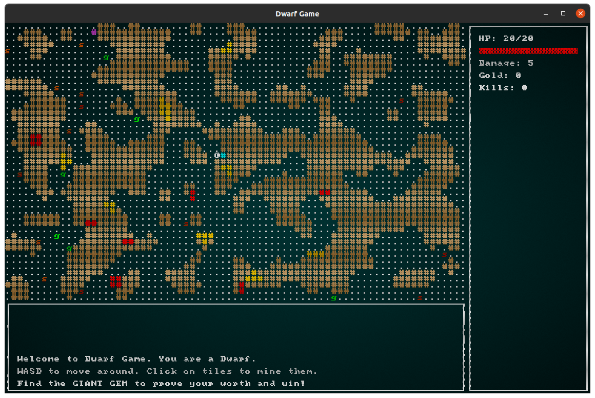

# Dwarf Roguelike

Dwarf Roguelike is a roguelike game written in rust, using the bracket-lib game engine,
and legion entity component system. It is a simple game, mine resources to
increase your stats, kill enemies, and find the "Giant Gem" to win.

## Usage
```
cargo run
```
From the project directory, run this command. It will build and run the binary for you.

## Game mechanics
### Monsters
* Spiders: Represented by an 's' these monsters move randomly, die in one hit and do 1 damage.
* Goblins: Represented by a 'g' are the more dangerous monster. They constantly move towards the
player and deal 3 damage per hit.

### Ores
* Gold: Mining this gives one gold per block to the player. It currently has no function other
than increasing the number in the UI.
* Red Crystal: Mining this adds 3 health to the player up to their max health per block.



## Testing
Independent functions were tested in unit tests in their own test modules per file. I could not
figure out a good way to unit test the game systems in `systems.rs`, which could be a hint that
they are not implemented in an intuitive way.

## Reflection
Creating this project was a great exercise in learning the rust language. It is the first time
that I have made a roguelike, so learning about entity component systems was very interesting as
well. 

Things that I still want to add are a limited vision system, so that the user cannot
see the entire map at once, and more unique monster player interactions and
mechanics. One thing that I was thinking of adding was to make the goblins path
towards the gold and mine it.

I will definitely continue to work on this project as it is very interesting and I
think that it has potential to be much cooler if I add more unique mechanics.

If I were to restart, I would have written this in a different game engine such as
bevy. I might end up trying to remake it using bevy in the future as well. Some
things in bracket-lib are not done the way that I would like them exactly, and I
think that it would be better implemeneted in a more full feature engine.

## References
https://bfnightly.bracketproductions.com/rustbook/  
https://pragprog.com/titles/hwrust/hands-on-rust/

## License
[MIT](https://github.com/shihadam/rust-roguelike/blob/main/LICENSE)